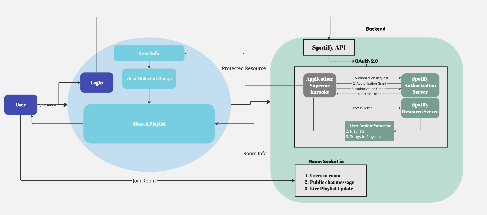
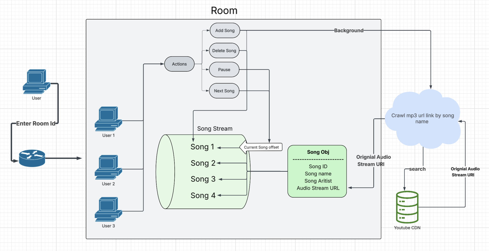

## Overview
The Collaborative Party DJ Web App solves the problem of managing music playlists at social gatherings by allowing multiple users to join a shared room, connect their Spotify accounts, and collaboratively manage a playlist in real time. The app leverages React and TypeScript for the frontend, Express for the backend, and socket.io for real-time communication.

## System Architecture
1. Frontend:
   1. Built with React and TypeScript using Vite.
   2. Connects to the backend via RESTful APIs for data and uses socket.io for real-time updates.
2. Backend:
   1. Built with TypeScript and Express.
   2. Provides endpoints for 
      1. User authentication
      2. Playlist management
      3. [Room functionality](./backend_design_doc.md)

3. Realtime communication:
   1. socket.io ensures instant updates to playlists across all connected users.
4. Spotify Integration and Why is User Data Safe
   
5. As mentioned in issue #11, using Spotify iframe doesn't help, we tried using service worker, adding proxy, XSS? but these are not ideal and won't give us the desired customization. Thanks to the help of [yt-dlp](https://github.com/yt-dlp/yt-dlp), we were able to get raw audio stream url and embed it in our website.
   

## API Design (TODO)
#### Authentication
#### Spotify Playlist Management
#### Room Management

## Backend Design
[More info here](./backend_design_doc.md)

## Cookies Management
   ### Why cookies are used?
   Cookies are essential for maintaining user state in web applications, especially when authentication or redirections occur. In this project, cookies serve a crucial role in preserving the user's session across page reloads and OAuth authentication flows. 

   Here are the cookie information we stoed
 - #### room_id (unique id)
   - Type: Integer
   - Description: Stores the ID of the room the user has joined, will clear after user quit
   - Usage: Helps in persisting the room state so that users remain in the same room even after refreshing the page. (Especially helpful since our web application is redirected back after Oauth in Spotify)

 - #### username (unique id)
   - Type: String
   - Description: Stores the username of the user.
   - Usage: Ensures the user’s name is retained across sessions, avoiding the need for re-entry.

#### Storage and Expiry
- The cookies are stored on the client-side.
- They are set to expire after 1 day (probably will changed to session based in the future)

## Challenges and Solutions
[More info here](./technical_challenges.md)

## Future Enhancements
1. Host can become the room master
2. Delete song choices
3. Store room specific playlist and next time user can login to listen to room playlist song

